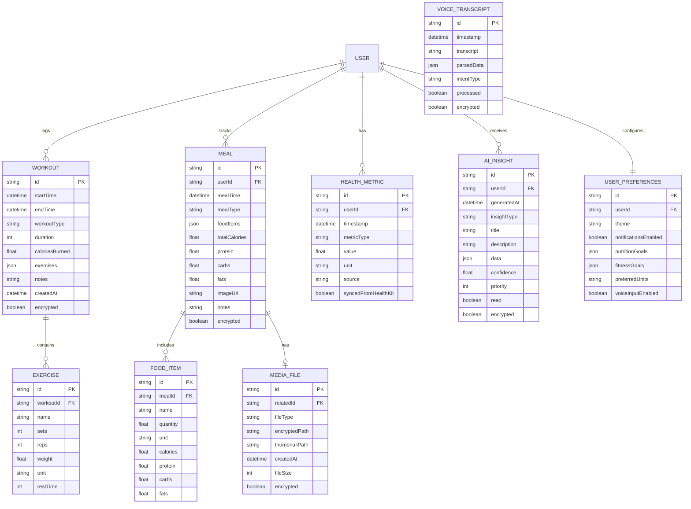

# Wellbeing Assistant - Architecture Diagram

## Overview
This document provides a comprehensive architectural overview of the Wellbeing Assistant iOS app, a privacy-first gym/wellbeing assistant built with React Native, TypeScript, and local-only AI processing.

---

## 1. High-Level System Architecture


**Legend:**
- Red: Data storage with encryption
- Yellow: Security/encryption services
- Green: External integrations

---

## 2. Detailed Component Architecture


---

## 3. Service Layer Architecture


---

## 4. Data Flow Diagram - User Input to Storage


---

## 5. HealthKit Integration Flow


---

## 6. AI Insights Generation Flow


---

## 7. Database Schema Architecture



---

## 8. Security & Privacy Architecture


---

## 9. Navigation Structure


---

## 10. Multi-Modal Input Processing Flow


---

## Technology Stack Summary

### Frontend
- **Framework**: React Native (iOS)
- **Language**: TypeScript
- **State Management**: Zustand
- **Navigation**: React Navigation (Tab Navigator)
- **UI Components**: Custom components with Reanimated

### Backend Services (Local Only)
- **Database**: Realm (with AES-256 encryption)
- **Health Data**: Apple HealthKit
- **AI/ML**: TensorFlow Lite (on-device inference)
- **Voice**: iOS Speech Framework
- **Storage**: iOS FileSystem (encrypted)

### Security
- **Database Encryption**: Realm encryption with keys in Keychain
- **File Encryption**: AES-256 for media files
- **Authentication**: Biometric (Face ID/Touch ID) + PIN
- **Network**: No network calls - 100% local processing

### AI Models
- **Pattern Recognition**: Workout pattern analysis
- **Trend Analysis**: Health metric trends
- **Nutrition Estimation**: Food image recognition
- **Recommendation Engine**: Personalized suggestions

---

## Key Architectural Principles

1. **Privacy First**: All data stays on device, no cloud sync
2. **Encryption Everywhere**: Data encrypted at rest and during processing
3. **Offline-First**: Full functionality without internet
4. **Performance**: Local AI inference for fast insights
5. **User Control**: User owns and controls all their data
6. **Modular Design**: Services are independent and testable
7. **Type Safety**: TypeScript for compile-time safety
8. **Reactive State**: Zustand for predictable state management

---

## Data Flow Patterns

### Read Pattern
```
User Action → UI Component → Zustand Store → Service → Database → Store Update → UI Re-render
```

### Write Pattern
```
User Input → Validation → Service Processing → Encryption → Database → Store Update → UI Feedback
```

### HealthKit Sync Pattern
```
HealthKit Change → Background Observer → HealthKit Service → Store Update → AI Trigger → Insight Generation
```

### AI Insight Pattern
```
Data Change → Aggregation → Preprocessing → TensorFlow Lite → Insight Generation → Encryption → Storage → Display
```

---

## Conclusion

This architecture provides a robust, privacy-focused foundation for the Wellbeing Assistant app. The modular design allows for easy testing, maintenance, and future enhancements while maintaining the core principle of keeping all user data local and secure.
